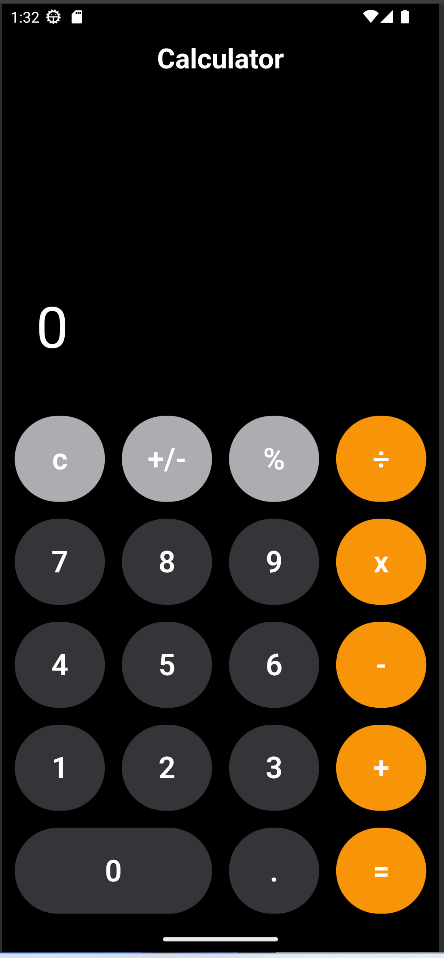

# Project Title
Mac Mobile Calculator
## Description
The Mac Mobile Calculator is a sleek, intuitive calculator application designed for mobile devices running on the Flutter framework. Inspired by the elegant design of macOS, this calculator offers a seamless and user-friendly experience, allowing users to perform a variety of mathematical operations with ease.

This app includes basic arithmetic operations, advanced functions, and a history feature that lets users review their previous calculations. The Mac Mobile Calculator is perfect for both casual users and professionals who need a reliable, efficient tool for their daily calculations.

## Screenshots
Include screenshots of your project to give a visual overview.



## Features
Basic Arithmetic Operations: Perform addition, subtraction, multiplication, and division with ease.

## Installation
To set up the Mac Mobile Calculator on your local machine, follow these steps:

```bash
# Clone the repository
git https://github.com/YoussefMohamed7557/macCalculatorFlutter.git

# Navigate into the project directory
cd macCalculatorFlutter

# Install dependencies
flutter pub get
